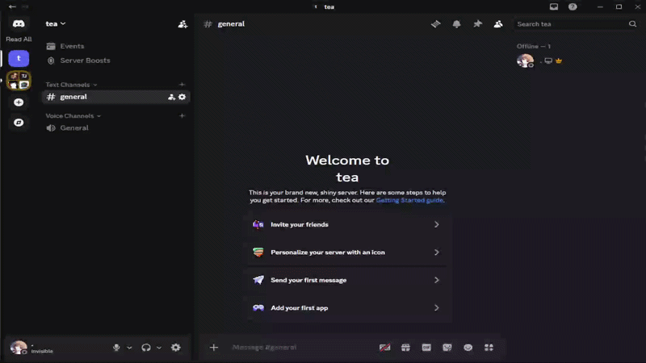

# Vencord All Mute Plugin (日本語)



* **[English Documentation (README.md)](README.md)**

サーバーを右クリックした際のコンテキストメニューに「All Mute」および「All Unmute」ボタンを追加し、ワンクリックでサーバーのすべての通知設定を一括でミュート・ミュート解除（通知設定の初期化）するVencord用カスタムプラグインです。

## プラグインの機能

### 1. All Mute（一括全ミュート）
実行すると、対象サーバーに以下の設定を一括適用します：
- **サーバーを通知オフ**: ミュート解除するまで (Until unmuted)
- **通知設定**: 通知しない (Nothing)
- **@everyoneと@hereの通知を行わない**: 有効 (Checked)
- **すべてのロール@mentionsを非表示にする**: 有効 (Checked)
- **ハイライト通知を受け取らない**: 有効 (Checked)
- **新しいイベントをミュート**: 有効 (Checked)

### 2. All Unmute（一括ミュート解除・初期化）
実行すると、すべての通知抑止を解除し、初期設定に戻します：
- **サーバーを通知オフ**: 解除 (Unmuted)
- **通知設定**: すべてのメッセージ (All Messages)
- **@everyoneと@hereの通知を行わない**: 無効 (Unchecked)
- **すべてのロール@mentionsを非表示にする**: 無効 (Unchecked)
- **ハイライト通知を受け取らない**: 無効 (Unchecked)
- **新しいイベントをミュート**: 無効 (Unchecked)

---

## 導入手順

Vencordをソースコードからビルドする環境に本プラグインを配置します。

### 1. プラグインファイルの配置
ご自身のローカルVencordソースコードの `src/userplugins` ディレクトリ内に `allMute` という名前のフォルダを作成し、本プラグインの `index.tsx` を配置します。

**配置パス：**
`[Vencordのルートフォルダ]/src/userplugins/allMute/index.tsx`

> [!TIP]
> `userplugins` フォルダが存在しない場合は、`src` の直下に新規作成してください。

### 2. Vencordのビルドと実行
Vencordのソースコードディレクトリで、以下のコマンドを実行してビルドを行います。

```bash
pnpm build
```
または、開発用ウォッチモードで起動します：
```bash
pnpm build --watch
```

ビルドが完了したら、Discordクライアント（またはVencordのインストールされた環境）を再起動またはリロード（`Ctrl + R`）してください。

### 3. プラグインの有効化
1. Discordの設定画面を開きます。
2. 左メニューの **Vencord** セクションにある **Plugins** をクリックします。
3. 検索窓で「**Server All Mute**」と検索します。
4. トグルスイッチを **ON** にして有効化します。

---

## 使用方法

1. 任意のサーバー（ギルド）アイコンを右クリックします。
2. メニュー最下部（または最上部）に追加された **`All Mute`** または **`All Unmute`** をクリックします。
3. 画面上に「`Server fully muted!`」または「`Server fully unmuted!`」とトースト通知が表示されます。
